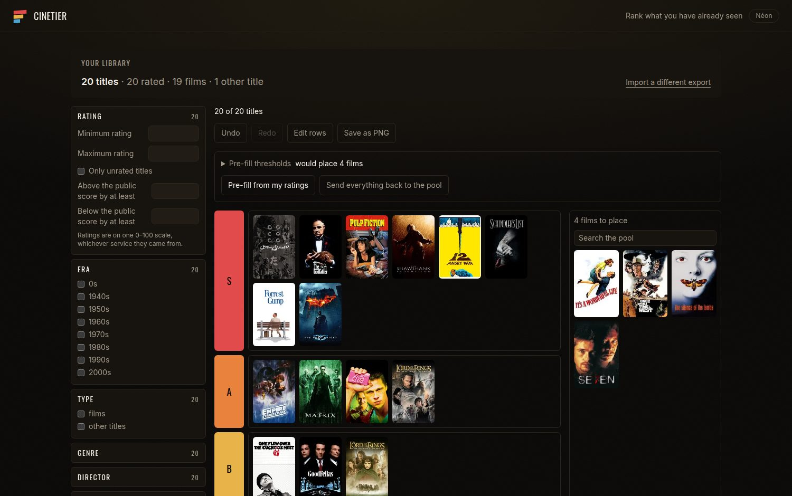
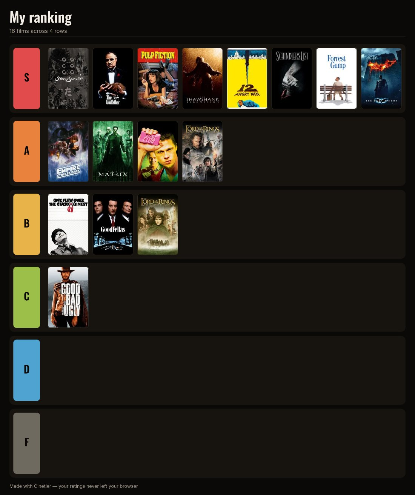

<div align="center">

# Cinetier

**Turn your film history into a tier list.**

Import your IMDb or Letterboxd export, filter it however you like, rank it by
dragging, and save the result as a picture.
Everything runs in your browser — no account, no upload, no server.

**[Open Cinetier →](https://myqzurdux3.github.io/cinetier/)**

[](https://github.com/myqzurdux3/cinetier/actions/workflows/ci.yml)
[](LICENSE)


</div>



---

## Why

You have rated hundreds of films on IMDb or Letterboxd, and that history is a
list you scroll, not a picture you can look at. Cinetier turns the export those
services already give you into a tier list — and it does it without asking you
to hand your taste to anyone.

## What it does

**Import your own data.** Drop in an IMDb export or a Letterboxd export `.zip`,
exactly as those services hand it to you — ratings, watchlists and lists alike,
films and series alike, in whatever language your account uses. Films you
imported from both services are matched and merged, so nothing appears twice.

**Filter before you rank.** A rail beside your library: rating, era, type,
genre, director, runtime, watch dates, rewatches and a top-N limit, each
section showing how many titles it admits on its own. Only films you watched
this year. Only those you rated above four stars. Only 1980s horror under 100
minutes. Only the ones you liked far more than everyone else did. Active
filters show as removable chips, and if a combination leaves nothing, the
screen names which one to drop.

**Rank on a board.** Default S/A/B/C/D/F rows, or your own — rename, recolour,
add, remove and reorder them, and removing a row returns its films to the pool
rather than deleting them. Drag a film into a row, between rows, or back to the
pool. Every move can be undone and redone. Keyboard works the same way: space
to lift, arrows to move, space to drop, with each step announced.

**Start from your ratings, or from nothing.** Cinetier can pre-fill the tiers
from the scores you already gave — the thresholds are yours to change, and it
tells you how many films each one would place before it places them — or you
can leave the board empty and rank entirely by hand.

**Keep as many lists as you like.** Name a board, duplicate it, start another.
Rank the same library three different ways and switch between them; each one
remembers its own ranking.

**Save it as a picture.** One button, one PNG: your rows, your colours, your
posters, in whichever theme you are looking at.



**Or as a file you can carry.** "Save as a file" writes a `.json` holding your
library and the board on screen. Drop it back in here, or into another browser,
and both come back — posters and all, without asking TMDB again. It is also
the only backup this application can give you, since nothing of yours is stored
anywhere but your own browser.

**Two looks.** Salle obscure by default, or a neon video-shop palette. Both are
remembered between visits, and neither one asks the network for a font.

## Privacy

Your ratings never leave your browser. There is no server and no account.

Your library, your filters and your board are stored locally, in the browser's
own database. The only outbound requests go to TMDB. Each one carries a title
and a year, or an IMDb identifier, to fetch a poster; the request that follows
it, for that film's genres, director and runtime, carries the TMDB identifier
the first request came back with. They never receive your ratings and never
receive your history.

## Getting your data

**IMDb** — Your Ratings page → the three-dot menu → Export. You will receive
`ratings.csv` by email or download.

**Letterboxd** — Settings → Import & Export → Export Your Data. Upload the
`.zip` as it is; Cinetier unpacks it for you. If you do not see an export
option, Letterboxd may require a Pro subscription for it; an IMDb export works
on any account, free or paid.

Because IMDb does not export watch dates, Cinetier uses your rating date
instead for IMDb imports, and labels it as such. Letterboxd diary entries carry
real watch dates.

## Running it locally

```bash
git clone https://github.com/myqzurdux3/cinetier.git
cd cinetier
npm install
cp .env.example .env.local   # then add a free TMDB API key
npm run dev
```

Get a key at [themoviedb.org/settings/api](https://www.themoviedb.org/settings/api).
It is read-only and ships in the client bundle by design — this application has
no backend to hide it behind, which is the same reason it has nowhere to send
your ratings.

## Development

```bash
npm run test        # watch mode
npm run test:run    # single run
npm run lint
npm run typecheck
npm run build
npm run e2e         # drag and drop, in a real browser — see e2e/README.md
```

The layering is enforced by ESLint, not by convention:

| Layer       | Holds                                          | May import             |
| ----------- | ---------------------------------------------- | ---------------------- |
| `parsers/`  | IMDb CSV and Letterboxd ZIP → a unified `Film` | `domain/`              |
| `domain/`   | every rule worth testing, as pure TypeScript   | nothing outward        |
| `services/` | the only network and storage access            | `domain/`              |
| `enrich/`   | the progressive TMDB fill-in                   | `domain/`, `services/` |
| `ui/`       | React, and nothing else                        | all of the above       |

`domain/` and `parsers/` import nothing from the outer layers and touch no
browser API — no `fetch`, no `window`, no `localStorage`. That is what lets the
interesting parts be tested as arithmetic, including where every piece of an
exported image goes.

See [CONTRIBUTING.md](CONTRIBUTING.md) before opening a pull request, and
[CHANGELOG.md](CHANGELOG.md) for what has landed.

## Licence

MIT. See [LICENSE](LICENSE).

## Attribution

This product uses the TMDB API but is not endorsed or certified by TMDB.
Posters in the screenshots above are served by TMDB and belong to their
respective rights holders.

Cinetier is not affiliated with, endorsed by, or connected to IMDb or
Letterboxd.
